# Market To Your Door

An e-commerce platform for fresh produce delivery including fruits, vegetables, and meats. Users can browse, search, and order items, while store admins can manage products, orders, and users through a custom admin dashboard.

## Preview
###  Live Site

[Visit the Live Site](https://market-to-your-door-c70be1568a56.herokuapp.com/)

### Responsive Design (Mobile, Tablet, Desktop)

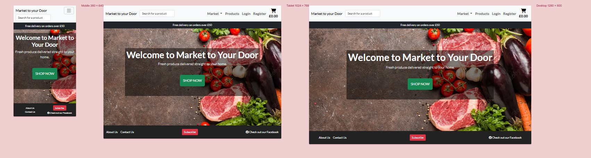


## Table of Contents
- [Features](#features)
- [Tech Stack](#tech-stack)
- [Developed Using](#developed-using)
- [Design Process](#design-process)
- [Data Model](#data-model)
- [SEO Optimizations](#seo-optimizations)
- [AWS Integration](#aws-integration)
- [Stripe Integration](#stripe-integration)
- [Custom Admin Dashboard](#custom-admin-dashboard)
- [User Permissions](#user-permissions)
- [Business Model](#business-model)
- [Marketing Strategy](#marketing-strategy)
- [Testing](#testing)
- [Deployment](#deployment)
- [Validation](#validation)
- [Acknowledgements](#acknowledgements)
- [Credits](#credits)
- [Author](#author)

---

## Features
### User
- Register, login (with modal forms)
- View product list and detail pages
- Add to cart (supports both guests and authenticated users)
- Secure checkout with shipping form
- Stripe payment integration
- Email confirmation for orders
- View previous orders (authenticated users)
- Subscribe to newsletter
- Submit contact form

### Product Management
- CRUD operations on products and categories
- Inventory updates after purchase
- Display average rating and user reviews
- Admin replies to reviews

### Sorting and Filtering
- User can search for a product in the nav-bar search box. Once they inputed the product name the need to press enter.
- In products page the user can filter the products by category, price, name. Once they selected the filter they need to press Apply filter

### Orders & Shipping
- Order status: Pending, Paid, Shipped, Delivered, Cancelled
- Admin can mark as shipped

### Reviews
- Users can leave reviews for products
- Admin can reply to reviews

### Admin Dashboard
- View all orders, manage users
- Promote/demote user roles (admin, manager, superuser)
- Add/edit/delete categories and products
- Reply to user reviews
- View contact form submissions

## Tech Stack
- Python 3.11
- Django 4+
- Django Allauth
- Stripe
- AWS S3
- PostgreSQL
- Bootstrap 5.3
- Crispy Forms 
- Heroku (for deployment)

---

## Developed Using

- This application was built using Visual Studio Code (VS Code) as the primary development environment. Extensions used include:
  - Python
  - Django
  - Prettier

- The project was version-controlled using Git and hosted on GitHub.
---

## Design Process

### Overview

The design of **Market to Your Door** followed an agile and user-centered approach. Agile user stories were written to define key features from the perspective of the end user. These stories helped prioritize functionality during sprints and ensured that the site met real-world needs.

#### User Stories
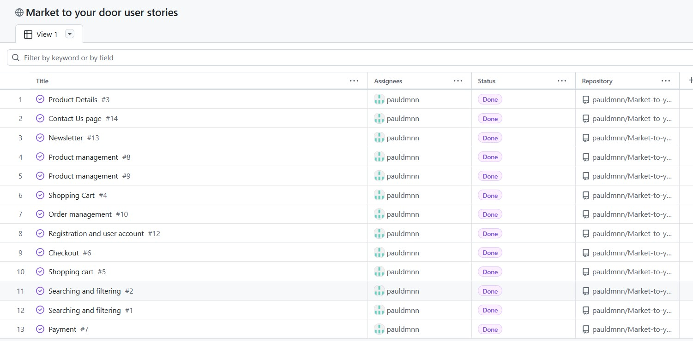

A clean, responsive layout ensures that users across all devices can easily browse, search, and purchase products.
This iterative planning ensured the design remained aligned with core functionality and business goals.

---

### Wireframes
Below are key wireframes created during the design phase:

#### Homepage Wireframe
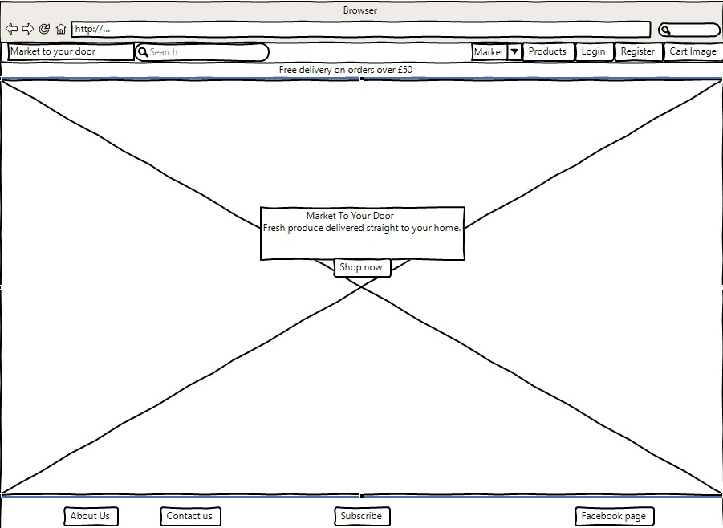

#### Product Listing Page Wireframe
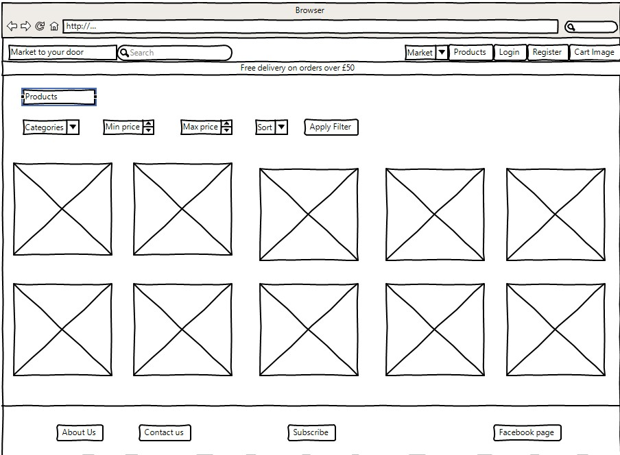

#### Checkout Page Wireframe
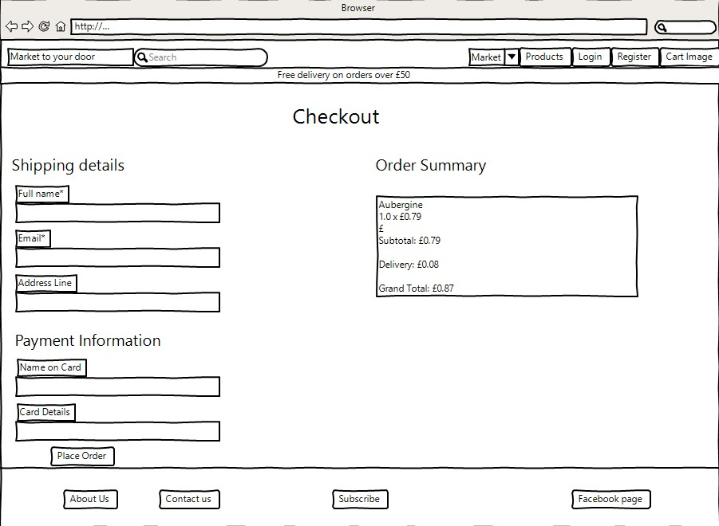

---

### Design Reasoning

- **Color Scheme**: Natural greens and neutrals were chosen to reflect the freshness and organic nature of the produce.
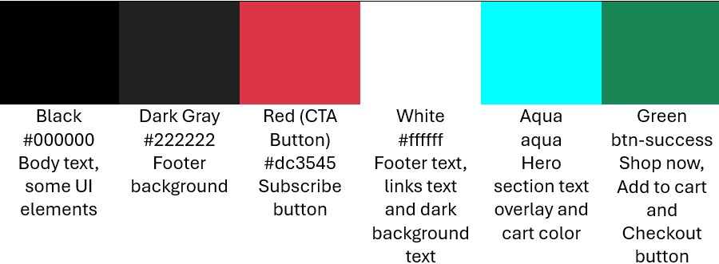
- **Typography**: Clean sans-serif fonts improve readability across all devices.
- **Imagery**: High-quality product images sourced from reliable datasets (Kaggle) were used to build trust and visual appeal.
- **Layout and UX**: Simple navigation, a prominent “Shop Now” CTA, and clearly structured pages were implemented to reduce friction in the shopping experience.

These decisions ensured the final UI remained intuitive, user-centric, and aligned with industry standards for e-commerce.

---
## Data Model

The application uses a relational data model based on Django ORM, with the following core models and relationships:

### Product & Category Models

| Model      | Field Name       | Type               | Relationships / Notes                         |
|------------|------------------|--------------------|------------------------------------------------|
| Category   | name             | CharField          | Category name                                  |
|            | slug             | SlugField          | Used for SEO-friendly URLs                     |
| Product    | name             | CharField          | Product title                                  |
|            | slug             | SlugField          | Unique slug                                    |
|            | description      | TextField          | Product description                            |
|            | price            | DecimalField       | With `price_unit` as choice (piece, gram, kg)  |
|            | price_unit       | CharField          | Choices: piece, gram, kilogram                 |
|            | image            | ImageField         | Product image                                  |
|            | inventory        | PositiveInteger    | Inventory count                                |
|            | category         | ForeignKey         | Linked to Category                             |

---

### Cart & Order Models

| Model      | Field Name       | Type               | Relationships / Notes                         |
|------------|------------------|--------------------|------------------------------------------------|
| Order      | user             | ForeignKey         | Linked to `User`                               |
|            | full_name        | CharField          | Customer name                                  |
|            | email            | EmailField         | Customer email                                 |
|            | address fields   | CharFields         | Includes address1, city, postcode, country     |
|            | total_price      | DecimalField       | Order total                                    |
|            | status           | CharField          | Pending, Paid, Shipped, Delivered              |
| OrderItem  | order            | ForeignKey         | Linked to Order                                |
|            | product          | ForeignKey         | Linked to Product                              |
|            | quantity         | IntegerField       | Amount ordered                                 |

---

### User & Profile Models

| Model        | Field Name     | Type           | Relationships / Notes                          |
|--------------|----------------|----------------|-------------------------------------------------|
| User         | (Built-in)     | -              | Managed via Django Allauth                      |
| UserProfile  | user           | OneToOneField  | Linked to User                                  |
|              | phone_number   | CharField      | Optional phone                                  |
|              | address fields | CharFields     | Shipping information                            |
|              | is_admin       | BooleanField   | Role-based permissions                          |

---

### Review Model

| Model    | Field Name     | Type           | Relationships / Notes                          |
|----------|----------------|----------------|-------------------------------------------------|
| Review   | product        | ForeignKey     | Linked to Product                               |
|          | user           | ForeignKey     | Linked to User                                  |
|          | rating         | IntegerField   | 1–5 stars                                       |
|          | comment        | TextField      | User review                                     |
|          | admin_reply    | TextField      | Optional admin reply                            |

---

This model supports full CRUD operations, review/reply interactions, cart-to-checkout flow, and inventory control.

---

## SEO Optimizations
- Meta titles and descriptions on:
  - Home page
  - Product list & product detail
  - Category list
  - Contact, About, Newsletter
- Image alt tags on product images
- Sitemap and robots.txt
- Clean URL slugs for products and categories

### Sitemap Setup
 - Sitemap was created usin XML-Sitemaps.com Sitemap Generator.
 - The sitemap file is located in the base directory sitemap.xml

---

### How to Run Locally
  # Clone the repository
  git clone https://github.com/yourusername/market-to-your-door.git
  cd market-to-your-door

  # Create and activate a virtual environment:
  python -m venv venv
  source venv/bin/activate  # On Windows use: venv\Scripts\activate

  # Install dependencies:
  ```bash
  pip install -r requirements.txt
  ```

  # Add a env.py file with your environment variables:
  SECRET_KEY=your-secret-key
  DEBUG=True
  STRIPE_SECRET_KEY=your-stripe-secret
  STRIPE_PUBLIC_KEY=your-stripe-public
  STRIPE_WEBHOOK_SECRET=your-webhook-secret
  AWS_ACCESS_KEY_ID=your-aws-key
  AWS_SECRET_ACCESS_KEY=your-aws-secret
  AWS_STORAGE_BUCKET_NAME=markettyd

  # Run migrations and start server:
  ```bash
  python manage.py migrate
  python manage.py runserver
  ```


---

## AWS Integration (S3 Bucket)
- Bucket name: `markettyd`
- Static and media file storage configured via `custom_storages.py`
- `collectstatic` pushes CSS, JS, and image files to AWS S3
- Environment variables:
  - `AWS_ACCESS_KEY_ID`
  - `AWS_SECRET_ACCESS_KEY`
  - `AWS_STORAGE_BUCKET_NAME`

---

## Stripe Integration
- Stripe payment intent created during checkout
- Webhook to `/stripe/webhook/` processes `payment_intent.succeeded`
- Inventory is reduced, email confirmation sent, and order marked as paid
- Custom webhook handler logs and processes events

---

## Custom Admin Dashboard
- Accessible by admins and superusers
- Filter orders, view product list, add new categories/products
- Edit and delete existing products
- Respond to user reviews

---

## User Permissions
1. **Superuser**: Full access, can promote users to any role
3. **Admin**: Can only manage orders, products and categories
4. **Normal User**: Shop and checkout

---

## Business Model

### Business Type

**Business-to-Consumer (B2C)**  
Market to Your Door is a B2C e-commerce platform that sells fresh fruits and vegetables, directly to individual consumers via an online storefront. All interactions occur between the platform and the end user through the website.

---

### Target Audience

Our service is aimed at individuals who value convenience, freshness, and quality in their food sourcing. The core audience includes:

- **Busy Urban Families** – who need convenient and reliable grocery delivery
- **Health-Conscious Shoppers** – who prioritize fresh and locally-sourced food
- **Elderly or Mobility-Limited Customers** – who benefit from home delivery
- **Environmentally-Conscious Buyers** – who seek plastic-free, fresh produce

---

### Customer Needs & Platform Solutions

| **Customer Need**                      | **Our Solution**                                                                 |
|----------------------------------------|----------------------------------------------------------------------------------|
| Access to fresh fruits and vegetables  | Products are sourced from local suppliers and updated regularly                 |
| Easy online shopping experience        | Clean UI, categorized products, search & filtering features                     |
| Fast and secure checkout               | Stripe integration for trusted, encrypted payments                              |
| Product trust and transparency         | Customer review system with admin replies                                       |

---

### Revenue Model

- **Direct Product Sales**: Each item is sold individually (by piece, gram, or kilogram) via a secure checkout process.
- **No Subscription or Recurring Billing** is currently implemented.

---

### Competitive Advantage

- Hyperlocal focus on quality and freshness  
- Full control and customization via a custom-built Django platform  
- Admin-managed reviews and support  
- Secure Stripe payment gateway integration  
- Professionally styled user and admin interfaces

---

## Marketing Strategy

- SEO-optimized content and URLs
- Newsletter with email confirmation
- Facebook page linked in the footer
- CTA "Shop Now" button on the landing page
- Customer reviews to build trust
- Social proof (testimonials, FAQs coming soon)

---

Facebook Marketing Integration

Market To Your Door has a fully operational Facebook page with:

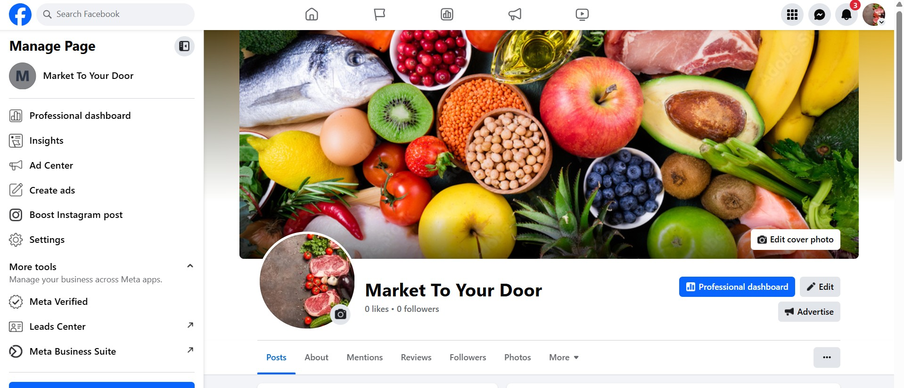
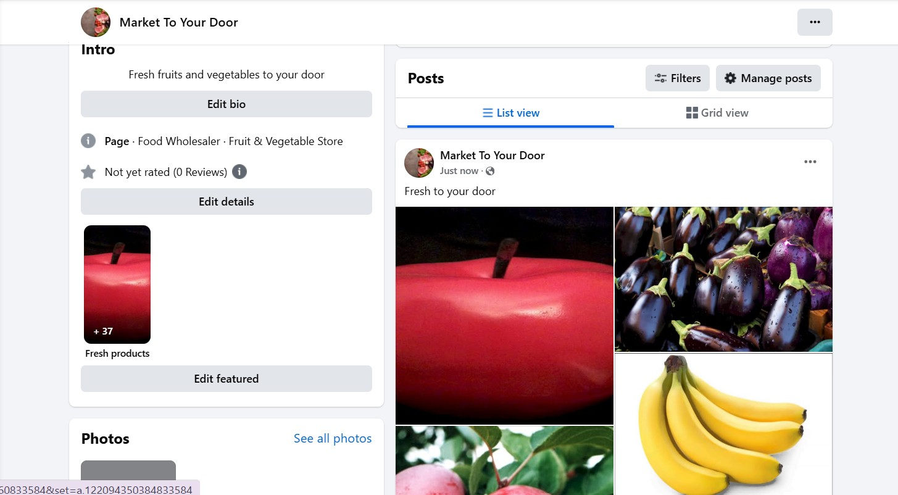

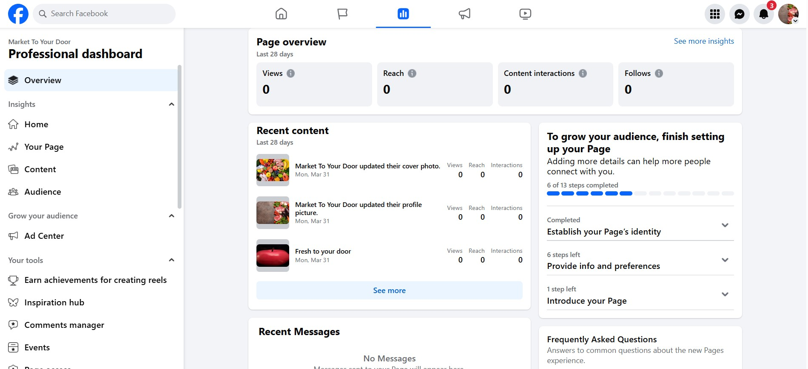


Visit our Facebook Page →

---

## Testing
- Test-driven development using `pytest`
- Test completed in the app's test.py
- Models, views, forms, and custom logic are tested

Run tests:
```bash
pytest 
```
# Automated Tests:
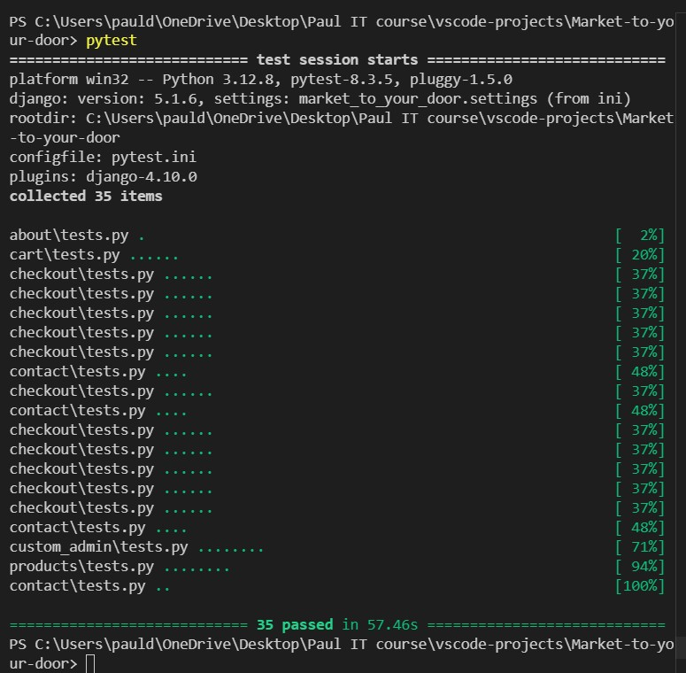

# Manual Testing:

A full suite of manual test cases is documented in a table format for all core features including checkout, forms, cart logic, and permissions.


| #  | Feature                     | Test Case Description                                             | Expected Result                                                       |
|----|-----------------------------|--------------------------------------------------------------------|------------------------------------------------------------------------|
| 1  | User Registration           | User can register using modal or registration page                | Account is created and user is redirected/logged in                  |
| 2  | User Login                  | User logs in using the login modal                                | User is authenticated and redirected to homepage                     |
| 3  | User Logout                 | User clicks logout in navbar or modal                             | User is logged out and returned to homepage                          |
| 4  | Profile Creation            | New user completes profile on registration                        | Profile is created in the profiles table                             |
| 5  | Profile Edit                | User edits full name, phone, or location                          | Data is saved and reflected in their account                         |
| 6  | Add to Cart (auth user)     | Authenticated user adds a product to cart                         | Cart is updated and quantity is shown                                |
| 7  | Add to Cart (guest)         | Guest adds product to cart                                        | Cart is stored in session                                            |
| 8  | Cart Quantity Update        | User updates quantity in cart                                     | Quantity changes and total updates accordingly                       |
| 9  | Product Page                | User visits individual product page                               | Product details and reviews are displayed                            |
| 10 | Product Filtering           | User filters products by category, price, or search               | Filtered products list is displayed                                  |
| 11 | Product Sorting             | User sorts products by price/name/category                        | Products are sorted correctly                                        |
| 12 | Product Out of Stock        | User tries to add out-of-stock product                            | Error message shown and product not added                            |
| 13 | Checkout Authenticated      | Auth user completes shipping form and checks out                  | Order is created, payment is triggered                               |
| 14 | Checkout Guest              | Guest completes checkout                                          | Order is created, session cart cleared, and payment processed        |
| 15 | Stripe Payment Success      | User completes payment via Stripe                                 | Order marked as paid, confirmation email sent                        |
| 16 | Stripe Payment Fail         | Payment fails during checkout                                     | Error message shown                                                  |
| 17 | Order Summary               | User views their order summary                                    | Correct order data is shown                                          |
| 18 | Order Email Confirm         | After successful order, user receives confirmation email          | Email contains order details and contact info                        |
| 19 | Admin Dashboard Access      | Superuser accesses /custom_admin/                                 | Dashboard is accessible only for admin roles                         |
| 20 | Add Product (admin)         | Admin adds a new product from dashboard                           | Product is added and visible in list                                 |
| 21 | Edit Product (admin)        | Admin edits existing product                                      | Product updates saved                                                |
| 22 | Delete Product (admin)      | Admin deletes a product                                           | Product is removed from list                                         |
| 23 | Add Category (admin)        | Admin adds a new product category                                 | Category is created and usable in product forms                      |
| 24 | Delete Category w/ Product  | Admin tries to delete category that has products                  | Error shown preventing deletion                                      |
| 25 | Promote to Admin            | Superuser promotes user from manage users page                    | User now has admin access                                            |
| 26 | Demote Admin                | Superuser demotes admin from manage users                         | User loses admin privileges                                          |
| 27 | View Reviews                | Admin views all product reviews in dashboard                      | List of all reviews is shown                                         |
| 28 | Reply to Review             | Admin replies to a review                                         | Reply is saved and visible on product page                           |
| 29 | About Us Page               | User visits /about/ page                                          | Content from AboutUs model is shown                                 |
| 30 | Contact Form Submission     | User fills and submits contact form                               | Entry saved in DB and success message shown                          |
| 31 | Newsletter Subscribe        | User submits email for newsletter                                 | Subscriber added, and confirmation email sent                        |
| 32 | Duplicate Newsletter        | Same email tries to subscribe again                               | Error shown – already subscribed                                     |
| 33 | SEO Metadata                | View page source of key views                                     | Contains unique title, meta description, OpenGraph tags             |
| 34 | Favicon                     | Browser tab shows site icon                                       | Correct icon is loaded                                               |
| 35 | Responsive Navbar           | Burger menu collapses navbar on mobile                            | Mobile view shows dropdown properly                                  |
| 36 | Responsive Footer           | Footer stacks on small screens (2-column layout)                  | About/Contact left, Subscribe/Facebook right                         |
| 37 | Admin Login Restriction     | Non-admin tries accessing /custom_admin/ or editing user roles    | 403 Forbidden or redirect to login                                   |
| 38 | Webhook Trigger             | Stripe webhook fires after payment                                | Order updated to "Paid" and stock reduced                            |
| 39 | Inventory Reduction         | Product quantity reduces after order                              | Inventory updates in DB                                              |
| 40 | Search                      | User searches for product by name                                 | Matching products are returned                                       |


---

## Deployment

-The main branch of this repository is the most current version and has been used for the deployed version of the site. The Code -Institute student template was used to create this project.

# Code Institute Template

- Click Use This Template button.
- Give your repository a name, and description.
- Open Github and log into your account.
- Click New Workspace button.
- Create a workspace from your project repository by creating a clone.

# Heroku
- Hosted on Heroku
- Uses Heroku PostgreSQL
- AWS S3 for static/media
- Add the following config vars:
  - `DEBUG=False`
  - `AWS_STORAGE_BUCKET_NAME`, `AWS_ACCESS_KEY_ID`, `AWS_SECRET_ACCESS_KEY`
  - `STRIPE_SECRET_KEY`, `STRIPE_PUBLIC_KEY`, `STRIPE_WEBHOOK_SECRET`

```bash
git push heroku main
heroku run python manage.py migrate
heroku run python manage.py collectstatic --noinput
```

# Fork
- Go to the original GitHub repository.
- Click the Fork button in the top-right corner.
- GitHub will copy the repo into your account.
- Then you can clone it locally:
```bash
git clone https://github.com/YOUR_USERNAME/your-forked-repo.git
```

# Clone
- On the GitHub repo page, click the Code button.
- Copy the HTTPS URL.

- In your terminal:
```bash
git clone https://github.com/username/repository-name.git
```

- Navigate into the cloned project:
```bash
cd repository-name
```

- Install dependencies and start development:
```bash
python -m venv venv
source venv/bin/activate
pip install -r requirements.txt
```
----

## Validation
# HTML
- No errors were returned on validator.w3.org/
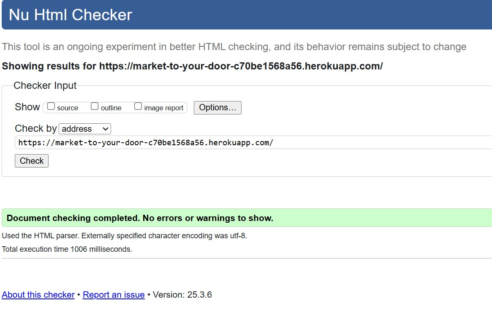

# CSS
- No errors were returned on jigsaw.w3.org
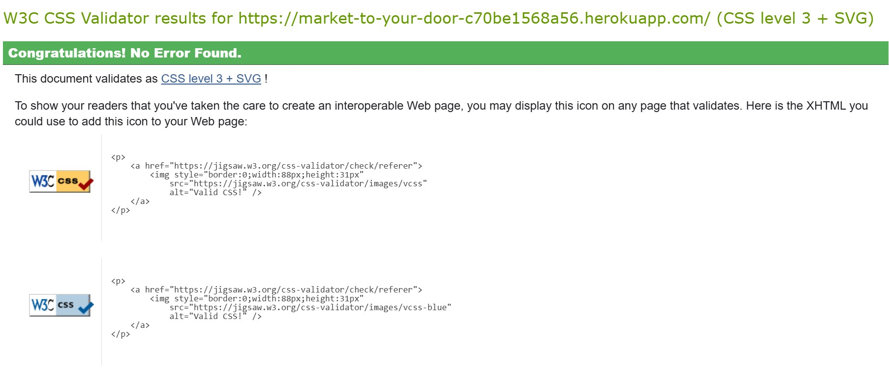

---

## Acknowledgements

- Django Documentation
- Stripe Docs
- AWS S3 Docs
- Crispy Forms
---

## Credits
- Google for idea and content
- Kaggle.com for photos
- GitHub, Stack Overflow, ChatGPT, geeksforgeeks.org and YouTube for various code assistace
---

## Author

Paul Dominan - Full Stack Developer Student
GitHub: @pauldmnn